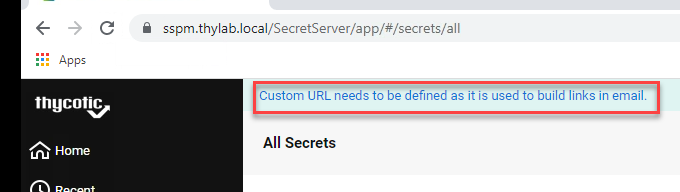

.. _day1:

---------------------------------------
Step 1 - Account Vaulting and Discovery
---------------------------------------

Step 1 is to find a solution in the proposed vendor's solution stack to solve the discovery and vaulting of privileged accounts.
Mary heads to the internet to see what the definition is off a privileged accounts and finds the following `article <https://www.ssh.com/academy/iam/user/privileged-account#:~:text=A%20privileged%20account%20is%20a,modify%20system%20or%20application%20configurations>`_.
This article describes a Privilege Account as:

A privileged account is a user account that has *more privileges than ordinary users*. Privileged accounts might, for example, *be able to install or remove software, upgrade the operating system, or modify system or application configurations*. They might also have access to files that are not normally accessible to standard users.

There are many kinds of privileged accounts:

- **Root** and **administrator** accounts are typically used for installing and removing software and changing configuration. They are superuser accounts.
- **Service accounts** are used for running processes, such as web servers, database servers, and application servers.
- **System accounts** are used for running operating system components and owning related files.

Privileged access management (PAM) refers to a set of processes and tools for controlling, monitoring, and auditing privileged access. Traditional PAM solutions are typically based on password vaults and password rotation, whereas modern next generation systems avoid passwords altogether.

Preparation
-----------

As step 1 is about discovery and vaulting, Secret Server is the designated ThycoticCentrify's solution. She has downloaded the Secret Server software and received the licenses in her email so she can get started.

During some reading of the `documentation <https://docs.thycotic.com>`_ she marks down the `requirements <https://docs.thycotic.com/ss/11.1.0/secret-server-setup/system-requirements/index.md>`_ of the machine for a minimum installation.

- 2 vCPUs
- 4 GB RAM
- 25 GB HDD
- Windows 2012 or higher
- IIS installation
- SQL Database, Express can work for testing purposes

Mary has set out to build a small environment which mimics the environment of ACME and names it Thylab.local as ThycoticCentrify is the vendor. If any other vendors are to be tested, she just recreates them accordingly. This environment has:

1. Domain Controller (DC1 - Windows 2016)
2. Machine for Thycotic software with SQL server (SSPM - Windows 2016)
3. Linux machine (CentOS - CentOS 7)
4. Windows client (Client - Windows 2016)

The graphical representation looks like this:

.. figure:: images/001.png

Installation of Secret Server
-----------------------------

After logging in to the SPM server using the account **adm-training**, she saves the downloaded software on the desktop of her machine for the Thycotic Software (SSPM) so it is ready to be installed. After that she started the installation by double clicking the **setup.exe** file.

.. figure:: images/lab-01a.png

She **unchecked** the *Privilege Manager* as this is not needed yet, but it will be in a future step, and clicked next.

.. figure:: images/lab-ss-003.png

In the Database section she selected the **Connect to an existing SQL Server** and clicked **Next**

.. figure:: images/lab-ss-004.png

The checks will be run automatically and will only have a warning on the HTTPS binding. She clicks text and understands the reason. As the environemnt is using a self signed certificate, all good...

.. figure:: images/lab-ss-005.png

After clicking **Next** she provides the information asked for:

- Server name or IP: **SSPM\\SQLEXPRESS**
- Database name: **SecretServer**
- Windows Authentication using Service Account: **Checked**

.. figure:: images/lab-ss-006.png

She clicks **Next** to get to the next step. 

For the user name she uses **thylab\\svc_secretserver** with the password **Thycotic@2022!**. After clicking the **Validate Credentials** button a green tick and the text *Success* is shown. 

.. figure:: images/lab-ss-008.png

She clicks **Next** for the next step and uses the following information for the requested fields:

- User Name: **ss-admin**
- Display Name: **SS-Admin**
- Email: **ss-admin@thylab.local**
- Password and Confirm Password: **Thycotic@2022!**
- I understand: **Checked**

.. figure:: images/lab-ss-010.png

And clicks **Next**
For the email server, she has installed hMailserver on the SSPM server so some information can be send using email, she uses the following information:

- Email Server: **mail.thylab.local**
- From Address: **secret-server@thylab.local**

And clicks the **Send Test Email** button and sees that the Email server test was successful

.. figure:: images/002.png

After the test she click on **Next** to proceed to the overview page where she checks the info and clicks **Install** to start the installation.

.. figure:: images/lab-ss-012.png

The she grabs a coffee as she expects that the installation will take some time.

.. figure:: images/coffee-break.jpg

When she returns 5 minutes later the installation has succeeded and she clicks **Close**

.. figure:: images/lab-ss-013.png

She opens Chrome and opens the URL https://sspm.thylab.local/SecretServer and logs in using the ss-admin account and the correspond password. As this is the first time the IIS server installed is being asked information it will take a few seconds to minutes before the page is loaded. She remembers an `article <https://softwareengineering.stackexchange.com/questions/97538/why-after-each-restart-my-local-net-sites-take-time-to-load-for-the-first-time#:~:text=The%20slow%20reaction%20on%20your,new%20feature%20called%20auto%2Dstart>`_ that describes the reason.

After she has logged in she sees a blue bar mentioning something on a Custom URL. She clicks this text as email is something she wants to test as well for the installation. According to the text she clicked, when Secret Server sends email, it will also add the URL to the sent email so users can rather quickly open the UI.

She is being redirected to a page and scrolls all the way down and clicks **Edit**. Then she adds the custom url \https://sspm.thylab.local/SecretServer, 

.. figure:: images/004.png

ands set the timing to her region and preference

.. figure:: images/005.png

scrolls down and clicks **Save** 

She then navigates to **Admin > Licenses**, to inject the licenses she had received via email, and click **Install New Licenses**. Than checks Bulk Entry and grabs the license from the email and pastes them into field. After which she clicks **Install**

.. figure:: images/006.png

In the new screen that appears she click **Continue and Activate** provides a telephone number and clicks **Activate**
After the licenses have been activated, she opens her installed email client Thunderbird and see that she has an email that was send during installation time.

.. figure:: images/007.png

To make sure the email is still working, she navigates to **Admin > Configuration > Email tab** and clicks **Send Test Email** and sees the Green text that all is well. 

.. figure:: images/008.png

As she has an alias set up in the mailserver for the ss-admin@thylab.local account for her own email address MJane@thylab.local, she receives the test email sent by Secret Server.

.. figure:: images/009.png

She deletes both emails and closes Thunderbird. 

------

She recaps what she has done so far:

1. Prepared the virtual environment
2. Install Secret Server
3. Ran a basic configuration

"All great, I'm gonna call it a day for now... Let's cary on tomorrow with integration into an existing Active Directory and discover accounts (domain and local), secret creation, imports and password rotation..." she thinks. 

