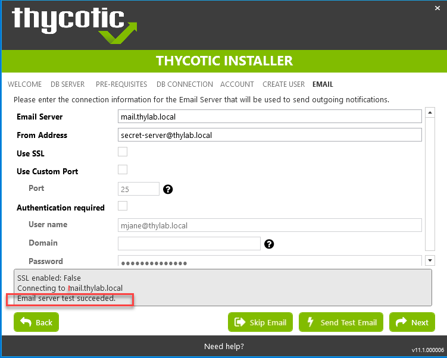
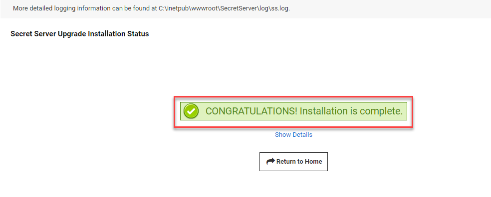
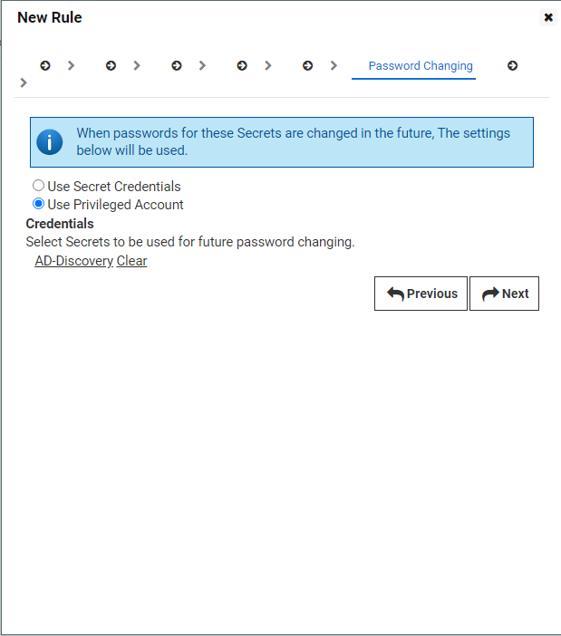

.. _day1:

---------------------------------------
Step 1 - Account Vaulting and Discovery
---------------------------------------

Step 1 is to find a solution in the proposed vendor's solution stack to solve the discovery and vaulting of privileged accounts.
Mary heads to the internet to see what the definition is off a privileged accounts and finds the following `article <https://www.ssh.com/academy/iam/user/privileged-account#:~:text=A%20privileged%20account%20is%20a,modify%20system%20or%20application%20configurations>`_.
This article describes a Privilege Account as:

A privileged account is a user account that has *more privileges than ordinary users*. Privileged accounts might, for example, *be able to install or remove software, upgrade the operating system, or modify system or application configurations*. They might also have access to files that are not normally accessible to standard users.

There are many kinds of privileged accounts:

- **Root** and **administrator** accounts are typically used for installing and removing software and changing configuration. They are superuser accounts.
- **Service accounts** are used for running processes, such as web servers, database servers, and application servers.
- **System accounts** are used for running operating system components and owning related files.

Privileged access management (PAM) refers to a set of processes and tools for controlling, monitoring, and auditing privileged access. Traditional PAM solutions are typically based on password vaults and password rotation, whereas modern next generation systems avoid passwords altogether.

Preparation
-----------

Step 1 is about vaulting and discovery, Secret Server is the designated Delinea's solution. The steps she is following is described `here <https://docs.delinea.com/secrets/current/getting-started-tutorial/1-trial-installation-prerequisites>`_ She has downloaded the Secret Server software and received the licenses in her email so she can get started.

During some reading of the `documentation <https://docs.delinea.com>`_ she marks down the `requirements <https://docs.delinea.com/ss/11.1.0/secret-server-setup/system-requirements/index.md>`_ of the machine for a minimum installation.

- 2 vCPUs
- 4 GB RAM
- 25 GB HDD
- Windows 2012 or higher
- IIS installation
- SQL Database, Express can work for testing purposes

Mary has set out to build a small environment which mimics the environment of ACME and names it Thylab.local as Delinea (formerly known as ThycoticCentrify) is the vendor. If any other vendors are to be tested, she just recreates them accordingly. This environment has:

1. Domain Controller (DC1 - Windows 2016)
2. Machine for software with SQL server (SSPM - Windows 2016)
3. Linux machine (CentOS - CentOS 7)
4. Windows client (Client - Windows 10)

The graphical representation looks like this:

Installation of Secret Server
-----------------------------

After logging in to the SPM server using the account **adm-training**, she saves the downloaded software on the desktop of her machine for the Delinea Software (SSPM) so it is ready to be installed. After that she started the installation by double clicking the **setup.exe** file.

She **unchecked** the *Privilege Manager* as this is not needed yet, but it will be in a future step, and clicked next.

In the Database section she selected the **Connect to an existing SQL Server** and clicked **Next**

The checks will be run automatically and will only have a warning on the HTTPS binding. She clicks text and understands the reason. As the environemnt is using a self signed certificate, all good...

.. figure:: images/lab-ss-005.png

After clicking **Next** she provides the information asked for:

- Server name or IP: **SSPM\\SQLEXPRESS**
- Database name: **SecretServer**
- Windows Authentication using Service Account: **Checked**

She clicks **Next** to get to the next step. 

For the user name she uses **thylab\\svc_secretserver** with the password **Thycotic@2022!**. After clicking the **Validate Credentials** button a green tick and the text *Success* is shown. 

.. figure:: images/lab-ss-008.png

She clicks **Next** for the next step and uses the following information for the requested fields:

- User Name: **ss-admin**
- Display Name: **SS-Admin**
- Email: **ss-admin@thylab.local**
- Password and Confirm Password: **Thycotic@2022!**
- I understand: **Checked**

.. figure:: images/lab-ss-010.png

And clicks **Next**
For the email server, she has installed hMailserver on the SSPM server so some information can be send using email, she uses the following information:

- Email Server: **mail.thylab.local**
- From Address: **secret-server@thylab.local**

And clicks the **Send Test Email** button and sees that the Email server test was successful

After the test she click on **Next** to proceed to the overview page where she checks the info and clicks **Install** to start the installation.

The she grabs a coffee as she expects that the installation will take some time.

When she returns 5 minutes later the installation has succeeded and she clicks **Close**

.. figure:: images/lab-ss-013.png

Initial configuration
*********************

She starts Chrome and opens the URL https://sspm.thylab.local/SecretServer. As this is the first time the IIS server installed is being asked information it will take a few seconds to minutes before the page is loaded. She remembers an `article <https://softwareengineering.stackexchange.com/questions/97538/why-after-each-restart-my-local-net-sites-take-time-to-load-for-the-first-time#:~:text=The%20slow%20reaction%20on%20your,new%20feature%20called%20auto%2Dstart>`_ that describes the reason. After she gets the login page, she logs in using the **ss-admin** account and the corresponding password.

After she has logged in she sees a blue bar mentioning tht there is an update available. As she hasn't provided licenses yet, she skips the update for now and navigates to **Admin > Configuration**. She scrolls all the way down and clicks **Edit**. Then she adds the custom url \https://sspm.thylab.local/SecretServer, 

and sets the timing to her region and preference

scrolls down and clicks **Save** 

She then navigates to **Admin > Licenses**, to inject the licenses she had received via email, and click **Install New Licenses**. Than checks Bulk Entry and grabs the license from the email and pastes them into field. After which she clicks **Install**

.. figure:: images/006.png

In the new screen that appears she click **Continue and Activate** provides a telephone number and clicks **Activate**
After the licenses have been activated, she opens her installed email client Thunderbird and see that she has an email that was send during installation time.

To make sure the email is still working, she navigates to **Admin > Configuration > Email tab** and clicks **Send Test Email** and sees the Green text that all is well. 

As she has an alias set up in the mail server for the ss-admin@thylab.local account for her own email address MJane@thylab.local, she click the **Get Messsages** button and receives the test email sent by Secret Server.

.. figure:: images/009.png

She deletes both emails and closes Thunderbird.

Upgrade
*******

She clicks **Home** in the navigation pane on the left of the UI and there is still the update message mentioned. She decides to click the message to see how that process works.

The message has redirected her to another page and she sees what needs to be done before the update can take place.
1. The environment has to be put in maintenance mode, she clicks **Enable Maintenance Mode** and then confirms by clicking **Enable**

   .. figure:: images/011.png

2. Backup; as there is no backup needed, there is not much in Secret Server other than some changes to the configuration, she checks the box below the **Backup** button, so that the system thinks that a backup has been made. "So Secret Server has a built-in backup process where not just the config, but also the database is being backup-ed?! Hmm great, that saves extra licenses for the backup software with respect to extra SQL and IIS agents..."

   .. figure:: images/012.png

3. Now that both option are green, the **Continue** button became activated and she clicks it..

After she clicked the button, whe gets an overview what the current version is and what the to be upgraded version will be. Clicking the **Download Latest Version** button will start the upgrade process.

After the download has succeeded there is another button available to install the newer version. She clicks the button and wait to see what happens...

Another screen opens and shows that the upgrade start AFTER clicking the **Upgrade** button. Clicking that button shows a progress screen on the different steps that are taken by the upgrade. Due to the upgrade, the screen goes gray-ish and indicates that the application is in the progress of upgrading

After a few seconds the screen refreshes and show the upgrade complete message

She clicks the **Return the Home** button. This takes a few minutes as the new version needs to be loaded and prepared into IIS. Same situation as when she started the UI for the first time..

"Hmm that was easy the upgrade process!! Ok so the environment goes into a maintenance mode, but what does that mean??". She opens a Chrome browser and searches on https://docs.delinea.com to see what happens in maintenance mode of Secret Server. She find the article she's looking for: https://docs.delinea.com/secrets/current/admin/maintenance-mode/index.md. In short what she reads is that the secrets are in read only mode, but are still accessible. "That is great news! I still want to make sure that we can schedule this, as it means that people can also not create secrets, but at least they can use the secrets...", she thinks.

Active Directory integration
----------------------------

Now that the basic installation and the upgrade has been done, she starts the next step to connect to a Directory Service. She navigates to **Admin > Directory Services** and clicks the **Continue** button

She clicks **Add Domain** and selects *Active Directory Domain*

For the fields that she needs to fill out she uses:

- Fully Qualified Domain name: **thylab.local**
- Friendly Name: **Thylab**
- Synchronization Secret: **Create New Secret**

For the secret she uses the following parameters:

- Folder: **SS-Admin** (click the blue text *No Folder Selected* and navigate to *Personal Folder > SS_Admin*)
- Secret Name: **AD-Sync**
- Domain: **thylab.local**
- Username: **svc_sync**
- Password: **Thycotic@2022!**
- Notes: *Account used for AD Synchronization Secret Server and thylab.local*

and clicks **Create Secret**. Back in the Active Directory screen, she clicks **Validate & Save**. 

She is then presented with a screen in which she can select which groups Secret Server should use for the synchronization. She adds the following groups:

- Administrators
- Domain Admins
- IT - Database Team
- IT - Desktop Team
- IT - Server Team
- IT - Unix Team
- Secret Server Administrators

And clicks **Save**. A new screen appears were she is asked if a synchronization needs to be run now. She accepts the default settings and clicks **Sync Now**

After a few seconds the UI shows that *Last Sync Finished* has been updated to **Just Now**. When she ran a refresh of the browser she sees that they system has created 18 users

Discovery
*********

As the Active Directory is now connected, Mary needs to run discovery to see what is where running with respect to privileged accounts. To do this she navigates to **Admin > Discovery** and clicks the **Continue** button. 

In the new screen she clicks **Enable Discovery** and confirms the enablement by clicking **Enable Discovery**. Clicking the **Create Discovery Source** button and selecting *Active Directory* she is presented with fields on what is to be used for the discovery and of what domain. 

She uses the following information:

- Discovery Source Name: **Thylab AD**
- Fully Qualified Domain Name: **thylab.local**
- Friendly Name: **Thylab AD**
- Discovery Secret: **Create Secret**

For the secret she uses the following parameters:

- Folder: **SS-Admin** (click the blue text *No Folder Selected* and navigate to *Personal Folder > SS_Admin*)
- Secret Name: **AD-Discovery**
- Domain: **thylab.local**
- Username: **svc_discovery**
- Password: **Thycotic@2022!**
- Notes: *Account used for AD Discovery Secret Server and thylab.local*

and clicks **Create Secret**

Back in the Discovery screen, the rest she leaves default and clicks **Create**

In the next screen she selects all options and clicks **Save**. In the top of the Discovery that opened, she clicks **Discovery** to return to the overiew, 

and clicks **Run Discovery Now > Run Discovery Scan**. 

Then she repeats the steps and selects **Run Computer Scan**. When both the Scan show at 24 hours countdown clock, she clicks **Discovery Network View** to see what has been discovered.

In the new screen she sees that there have been some accounts discovered on the three windows machines. Except the DC1, which is the domain controller so no local accounts make sense, she sees the Administrator account and wants to make sure they are managed, so password changers can be assigned.

Before she does anything with the accounts, she creates a folder structure for the secrets so they can be managed easier.

Secrets folder configuration
----------------------------

"*We encourage you to setup a folder structure and a few roles. The folder structure is how you will keep your secrets organized, and provide access to shared secrets. Additionally, roles ensure you are able to control access to different parts of Secret Server and assign permissions to view certain folders and secrets*." she reads `here <https://docs.thycotic.com/secrets/current/getting-started-tutorial/7-secret-server-framework>`_ .

She want to create a simple folder structure. The lower you get in the structure the more limited/secure the secrets should get. The following is her structure:

- IT - Team

  - IT - Service accounts
  - IT - Server Team
 
    - IT - Unix team
    - IT - Database team

  - IT - Desktop Team

- IT - Network Team

  - IT - Router (SSH)

To create the folder structure, she right-clicks on the *Secrets* text and selects **Add Root Folder**

and names it **IT - Team**. After she has created the root folder she creates the other sub folders using the same method by right-clicking the IT - Team folder and select *Add Subfolder* and uses IT - Service accounts as the name and clicks **Create New Folder**. She repeats the same steps for the other three sub folders off IT -Team. And repeats the creation of the remaining sub folders she wants to have. The end result looks like this:

Now that the folders are created she needs to set the correct  permissions to the folders.

The following permissions are to be set by her (she *adds the SS-Admin* to all):

.. list-table::
   :widths: 25 75
   :header-rows: 1
   
   * - Folder name
     - Group that can view
   * - IT - Team
     - All IT related groups, Domain Admins and Secret Server Administrators
   * - IT - Desktop team
     - IT - Desktop team
   * - IT - Network team
     - IT - Unix Team
   * - IT - Router (SSH)
     - IT - Unix Team
   * - IT - Server Team
     - IT - Database team, IT - Server Team and IT - Unix team
   * - IT - Database team
     - IT - Database team
   * - IT - Unix team
     - IT - Unix Team
   * - IT - Service accounts
     - Domain Admins and Secret Server Administrators

To make the permissions as she has set out she is running the following steps:

#. She right clicks the IT - Team folder she wants to set the permissions and selects *Edit Folder*

   .. figure:: images/036.png

#. Clicks **Edit** in the *Folder Permissions* section and add the group(s) that need access by clicking the **Add** button

   .. figure:: images/037.png

#. She then selects the groups that need access to the folder and clicks **Add**

   .. figure:: images/038.png

#. All added groups have the **View** right for *Folder Permissions* and *Secret Permissions*

   .. figure:: images/039.png

#. She clicks **Save** to save the changes she made

Now that she has the root folder correct for the rights, she moves to the *IT - Desktop* folder, right clicks it and selects *Edit Folder*. She slicks **Edit** in the *Folder Permissions* section and **UNCHECKS** *Inherit Permissions* and removes all but the **SS-Admin, Secret Server Administrator** and **IT - Desktop Team** groups using the *Remove* text next to the group.

After she has the permissions as she wants it, she clicks the **Save** button.

She then repeats all the steps as defined in her table she created earlier.

Move existing secrets
*********************

Now that she has the folders and their permissions ready to go, she is going to move the two earlier created secrets to the correct folder. In her **Personal Folders > SS-Admin**, she selects the two secrets by marking the check box in front of the secret. After the secrets have been selected she clicks the **Move to Folder** icon

In the new screen she navigates to **IT - Team > IT - Service Accounts** and selects **Move Secrets**

After the *Bulk Progress* has completed she clicks the **Close** button. To make sure it all went as she thought it would, she opens the IT - Service Accounts folders and sees the two moved secrets.

The initial configuration is done with respect to Domain, Domain discovery and folders. It's now time to start using the application and bring some things together.

Manage local Administrator account
----------------------------------

During the Discovery a few local Administrator accounts have been found. Mary wants to get these accounts managed by Secret Server. That way when people leave, they are not able to use the account after they have left the organization. Password rotation is very high on the agenda of the organization. People have come and gone over the last year, including 3rd Party support people, and it has been a big task to reset all the Administrator and Unix password to something new.

Mary hopes that using Secret Server this can be automated and run on a need to run basis...

She navigates to **Admin > Discovery** and clicks **Discovery network View**. Under the *Local Accounts* tab, she selects both the *Administrator* account on **CLIENT01** machine

Then she clicks the **Import** button. In the following screen she uses for Secret Type: **Windows Account** and Folder: **IT - Team\\IT - Server Team** the and leaves the rest default. Then she clicks **Next**

In the next screen she can not change anything and clicks **Next** and provides the known password **Thycotic@2022!** and clicks **Next**

She gets a warning that *Remote Password Changing is not enabled* and clicks **Finish**

In the next screen that is shown *Bulk Operation: Import Accounts* she sees that there are no errors and clicks **Close**

She navigates to **IT - Team > IT - Server Team** and sees the secret she just imported.

After opening the Secret, by clicking it, she sees a RDP Launcher. She clicks it an gets after a few seconds a screen on *Protocol Handler failed to Launch*

She click the **Download 64-bit** button and installs the downloaded MSI package. She then clicks the **Cancel** button and reclicks the *RDP Launcher*
Almost immediately she get a popup screen and checks the *Always allow sspm.thylab.local to...* and clciks the **Open RDPWinBootStrapper** button

On the *Secret Server: Secret Server Launcher Attempt* she clicks **Yes**

And the **Connect** button on the *Remote Desktop Connection* warning screen and **Yes** on the next warning screen.

The RDP session starts and she sees the Desktop."Wow that was easy! I also didn't have to login with user name and password...."

She closes the session and returns to the UI. "Now how do I import other local administrator accounts as we will have a lot in production, but also rotate the password of the account? Let's figure that out", she thinks.

Auto import and rotate passwords for the secrets
------------------------------------------------

She heads over to \https://docs.delinea.com and searches for Password Rotation and finds https://docs.delinea.com/secrets/current/remote-password-changing/index.md which is exactly what she is looking for. From that page she finds how to enable Remote Password Changing and what is supported Out-of-the-box (https://docs.delinea.com/secrets/current/remote-password-changing/password-changer-list/index.md).

She returns to the Secret Server UI and navigates to **Admin > Remote Password Changing**. On that page she clicks the **Edit** button and enables all options she sees as she wants to test everything she can so she has a good feeling on what the solution can and can not do. After that she clicks the **Save** button.

Now that she has enabled RPC, she reads on an see a page that describes how to assign an account for changing passwords (https://docs.delinea.com/secrets/current/remote-password-changing/assign-a-pw-changer-to-a-secret-template). 

"So I need to set the account that is to be used for the RPC in the corresponding Secret Template. Ok let's see how and what.". She navigates to **Secrets > IT - Team > IT - Server Team** and sees that the template for the imported secret is *Windows Account*.

She navigates to **Admin > Secrets Templates** and clicks the *Windows Account* template

Under the **Mapping** tab she finds the *Password Changing* settings and clicks the *Edit* text next to it. She clicks the **No Secret Selected** and selects the AD-Discovery account. As she knows that that secrets has Domain Admin rights, it can be used to change passwords on the local machines. All the machines that are in production are Domain members, so that should be ok. She clicks **Save** to confirm the change she made.

Now she wants to see if the password is going to be changed for the Local Administrator that is on Client01. She navigates to **Secrets > IT - Team > IT - Server Team** and click the **client01.thylab.local\\Administrator** secret. She clicks the :fa:`eye` icon on the General Tab and sees that the password is still the one she provided **Thycotc@2022!**.

She clicks the *Option* button to see what she can do, and sees the text **Change Password Now** and clicks it.

She leaves all the settings as they are and clicks **Change Password**. As soon as she has clicked the button a blue-ish bar is shown which is showing a tet that the password change is pending. 

A few seconds later she gets a message at the bottom of the page that the password change has completed successfully

She clicks the :fa:`eye` icon on the General Tab again and sees that the password has changed to something random.

To test the new password, she is going to use the RDP Launcher. After clicking the RDP Launcher, she gets the desktop and closes the RDP session. Now she tries an interactive session by opening the console of the CLIENT01 and tries to use the old password. The login failed. Using the new password, she is able to login to the client... 

"Hmm that is great, easy and fast to have a local administrator account changed. But what if I have many of them and I want to automate the import of users and the change of the passwords?"

Import rules
************

While browsing through the documentation she finds https://docs.delinea.com/secrets/current/discovery/general-information/discovery-rules/index.md. The document describes something interesting: *"Discovery account rules are search queries against the accounts found by discovery (and visible in the discovery network view). When these rules are created and run, accounts that match rules can be automatically imported as secrets. When matches are found, email notifications can also be sent out. The rule order determines the rule application order. Drag rules to reorder them. Rules can specify a combination of the domain or OU, the computer name and the account name."* which is exactly what she wants to have.

She navigates to **Admin > Discovery** and clicks the *Configuration* tab where she clicks the *Import Rules* button and clicks **Create Rule**. 

For the parameters, step 1, she uses **Local Admininstrator** for the *Name* field and Import **Local Administrators** for the *Description* field and clicks **Next**

In the next step she selects the Thylab AD as Discovery Source. For this to happen, she clicks *None Selected* and clicks on **Thylab AD**. She changes the *Scan Template* to **Windows Local Account**, leaves the *Computer Name Contains* blank, change the *AND* to *OR* and provides **Administrator** and the *Account name Contains* and clicks **Next**

Than she makes change to the Secret Type, sets it to **Windows Account**, Folder she sets to **IT - Team \\IT - Server team** and leaves the rest default and clicks **Next**.

In the new screen she sets **I want to change the password on the Account** and **I want a new random password for each created secret** and clicks **Next**

In the next screen she sets the secret to be used to the **AD-Discovery** and clicks **Next**

She then selects **Use Privilged Account** and reselects *AD-Discovery* and clicks **Next**

In the last screen she checks the *Send Email Alert for Accounts Found* and clicks **Finish**

She clicks the Back button and on the main screen for Discovery she clicks the *Run Discovery Now* and selects *Run Computer Account*. After the scans have finished she opens Thunderbird to see if she has received an email on a found account. She did. The email states that that an account has been found on the SSPM server.

She clicks on the link that is in the email and sees that the Administrator Account on the SSPM has the status managed.

She clicks on the *Secrets* folder in the UI and sees all secrets she can access. She clicks on the **SSPM.thylab.local\\Administrator** and navigates to the *Remote Password Changing* tab so she can see what is going on. While being on that tab, she clicks the **Options** button and selects *Change Password Now* to see if she can change the password using Secret Server, just the way as she had done with the Client01 machine.

She wants to have a Random Generated password and clicks **Change Password** to have it changed. The blue-ish bar comes up and after a few seconds she gets the same message saying that the password has change successfully

Auto rotate passwords
*********************

Now that she can rotate passwords manually she also sees the possibility, on the RPC tab, to have t done automatically.

She clicks the **Edit** text and checks the *Auto Change Enabled* setting. Then she makes a change to the *Auto Change Schedule* and sets it to Daily, 1 day, her current date as the starting date and her current time +5 minutes to see what happens and clicks **Save**.

She then waits 5 minutes so the RPC can do its job and she knows what will be shown in the UI on the secret. After a browser refresh, 5 minutes have passed, she sees that the status has become *Succeeded* and the Last RPC Date has changed to *Just now*

"Now that I understand the way Windows based machines can managed, how does it work with Linux/Unix systems? Let's find that out as we have some machines were I know they have the same issue with respect to password management."

Linux management
----------------

In her testing environment Mary has one CentOS 7 based machine that is somewhat alike what they use in the production environment. As she knows there are more then just one in the production environment, she wants to use discovery to "import" local accounts. Just the way it worked in the Windows environment. After a quick search on the documentation she finds what she is looking for https://docs.delinea.com/secrets/current/discovery/discovery-platform-specifics/unix-discovery/index.md.

She navigates to **Admin > Discovery** and clicks the *Create Discovery Source* and selects **Unix** and reads the overview page that is shown, and clicks **Next**

For the first field she needs to fill out she uses *Linux Machines* and clicks **Next**. For the IP Scan Range she provides **172.31.32.120 - 123** as that range is where the Linux machine is (172.31.32.121) and clicks **Next**

For the Secret she is going to have a new one created, so she clicks **Create New Secret**. A new tab in the browser opens and she uses the following information for the new secret:

- Secret Name: **CentOSUser** (that account is available on the machines in production AND on the test Linux machine)
- Username: **centosuser**
- Password: **Thycotic@2022!**
- Notes: **Secret used for discoveru on Linux machines CentOS based**

and clicks **Save** She returns to the other tab, by closing the tab that opened, and selects **Add Secret** and add the just created secret

and clicks **Finish**. Back in the overview page of the discovery page, she clicks *Run Discovery Now* and runs both options as she had done with the Active Directory discovery. She then grabs a cup of coffee as the results take some time to show.

After 5 minutes she returns and clicks **Discovery Network View**. Here she sees the Linux machines section and expands it.

------

TODO:

#. Run a launcher for the connection to the Unix machine
#. RBAC using roles
#. Proxyied run of SSH and RDP session

------

She recaps what she has done so far:

1. Prepared the virtual environment
2. Install Secret Server
3. Ran a basic configuration

"All great, I'm gonna call it a day for now... Let's cary on tomorrow with integration into an existing Active Directory and discover accounts (domain and local), secret creation, imports and password rotation..." she thinks. 

