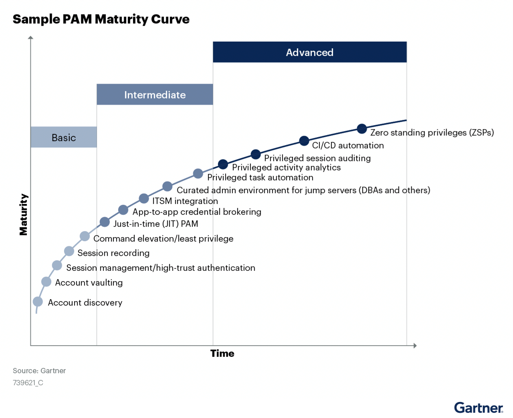

.. title:: Delinea - Full Stack Handson Training

.. toctree::
   :maxdepth: 2
   :caption: Day 1
   :name: _day1
   :hidden:

   day1/day1

.. toctree::
   :maxdepth: 2
   :caption: Day 2
   :name: _day2
   :hidden:

   day2/day2

.. _getting_started:

--------------------
Scenario description
--------------------

John and Mary are both working at the ACME corporation in the IT department. Bill, their manager, has asked to investigate how Acme could possibly introduce Privilege Access Management. Reasons for the request from Bill is that he got asked by ACME's board how they are limiting their attack surface.

One of the reason they asked Bill this is that they have seen a Verizon report that the amount of Ransomware attacks has grown almost 100% since 2020. More and more news articles are mentioning organizations that have become a victim. As Bill has no good answer they requested that Bill's team finds possible solution(s) to make sure the attack surface becomes smaller.
For the request Bill has given John and Mary three tasks:

1. How can ACME follow Gartner's PAM model (as been given by the board)?
2. How can ACME start a journey to become as compliant as possible to the PAM Model, using a "journey" model?
3. How is the implementation run?

For the third task, Bill wants to make sure that John and Mary, focus on topics in the following order:

1. The data center should be highly protected. Not just Windows, but also Linux machines
2. Protect the machines of the users, without impacting them to much
3. Allow the ACME contractors to connect to their data center servers in a secure manner, not using VPN as that is the current situation

Research phase
--------------

Before the start of their given tasks, John and Mary need to see what the Gartner PAM Model is all about. Searching the internet John and Mary find an article that Gartner describes PAM to have four pillars (https://www.gartner.com/smarterwithgartner/the-4-pillars-of-privileged-access-management)
The pillars are:

1. **Track and Secure every Privileged account**
   
   The discovery of privileged accounts is fundamentally important because the existence of any unaccounted privileged access, for even a short time, carries significant risk. Discovery processes must be continuous because change is constant.

2. **Govern and control access**

   There are two keys to achieving privileged access governance and control. First, establish effective life cycle processes to ensure that all changes in accounts with privileged access are known; and second, establish proper tracking to account for every privileged account and what the account can access. 

   Just-in-time access is the recommended method for privileged access because it is based on the principle that access is granted only for a short period and then removed, leaving no standing privileged access.

   Ultimately, this is about ensuring that the appropriate access is given so that you are driving PAM (and not allowing PAM to drive you). By having a solid understanding of current PAM use, it is easier to determine how PAM will function in an environment. 

3. **Record and audit privileged activity**

   An effective PAM program requires visibility into what privileged users do and changes that have been made. A combination of tools (whenever possible and feasible) establishes visibility.
   
   Privileged session recording can provide visualizations of privileged activity, and should be a critical part of a PAM toolkit. Expending a great deal of time reviewing session recordings can be a mind-numbing and ineffective exercise. Look for vendors that differentiate their products by providing users with tools that more easily find unusual activity in logs and recordings

4. **Operationalize privileged tasks**

   Automation initiatives can be overlooked when building a PAM practice. Good targets for automation are predictable and repeatable tasks, such as simple configuration changes, software installations, service restarts, log management, startup and shutdown. 
   
   Effective automation should increase reliability and security by removing the “human” element, thus increasing efficiency and ultimately helping the business reach its strategic objectives. Supporting new DevOps or robotic process automation (RPA) initiatives, or delegating privileged access for third parties, for example, should not go unrecognized when implementing PAM tools. 
   
   This is also where interaction with other PAM tools provides value. Use change control management tools for just-in-time PAM access, manage PAM account life cycle management with an identity, governance and administration (IGA) tool, or use single sign-on and multifactor authentication to access the PAM tool.

Via some other reports from Gartner, they found a figure that holds all the possible topics for the 4 pillars

Using this figure Mary and John started planning for their quest for the PAM journey....

Planning phase
--------------
Using the figure they have set the following steps to get to their end goal.

1. Account vaulting and discover
2. Command elevation/least privilege
3. Just in Time Privilege
4. Privileged Session auditing
5. Zero Standing privileges

As the first priority from Bill was the Data centers, Mary will lead this as she is responsible for the data center infrastructure. John, responsible for databases and the users infrastructure will join, but will not have a priority on this priority one.
Looking again at the figure, they decided to talk to Bill as there might also be a possibility to ask Lucy Andrews to join their team. Lucy is responsible for the DevOps environment for ACME and as the graph is also talking about CI/CD, she might be off importance to be added to the project as well. 

| After their talks, Bill thought that bringing Lucy into the project is a good idea, but later, after they have solved the first three priorities (data center, user machines, third party access). They added a sixth step to their plan, the total list has become:

1. Account vaulting and discover
2. Command elevation/least privilege
3. Just in Time Privilege
4. Privileged Session auditing
5. Zero Standing privileges
6. Bring DevOps in the mix

During the discussion Mary and John had with Bill, he mentioned that Delinea (formerly known as ThycoticCentrify) has been mentioned by the board due to their amount of `Gartner's Peer Reviews <https://www.gartner.com/reviews/market/privileged-access-management>`_. The amount of reviews and the number of stars they received, has been the major factor for them to propose the name as their first vendor off choice.

Looking at the website of Delinea, she has done some research on the six topics and assigns the solutions to the six topics.

1. Account vaulting and discover - Secret Server
2. Command elevation/least privilege - Servers: Server/Cloud Suite, for user machines: Privilege Manager
3. Just in Time Privilege - Servers: Server/Cloud Suite, for user machines: Privilege Manager
4. Privileged Session auditing - Servers: Server/Cloud Suite, for user machines: Secret Server
5. Zero Standing privileges - MFA via Cloud Suite
6. Bring DevOps in the mix - Secret Server and DevOps Secret Vault

.. TODO::
   for now: 

   - Secret Server (vaulting and discovery)
   - Server/Cloud Suite
   - Privilege Manager
   - Account Lifecycle Manager(?)
   
   Add DSV to the mix, but need to have an environment to build it.. Maybe further on as separate/extra days to the lab.